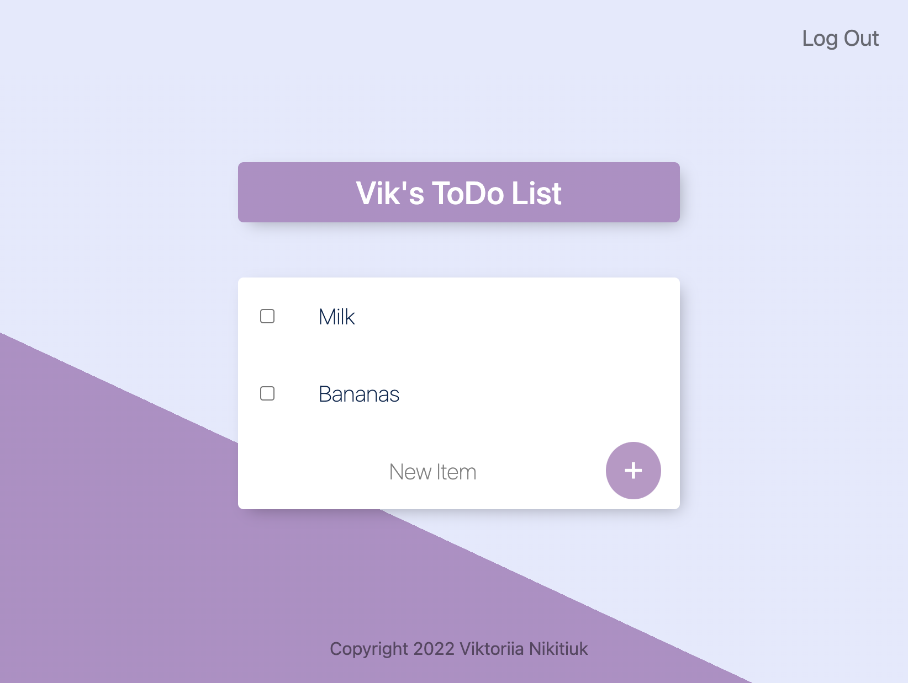

# To Do List
This is a small app for managing to do lists. It supports multiple users.

The app is written in Python/Flask and uses MySQL to store users and todos.

## Screenshots
To do list interface:
